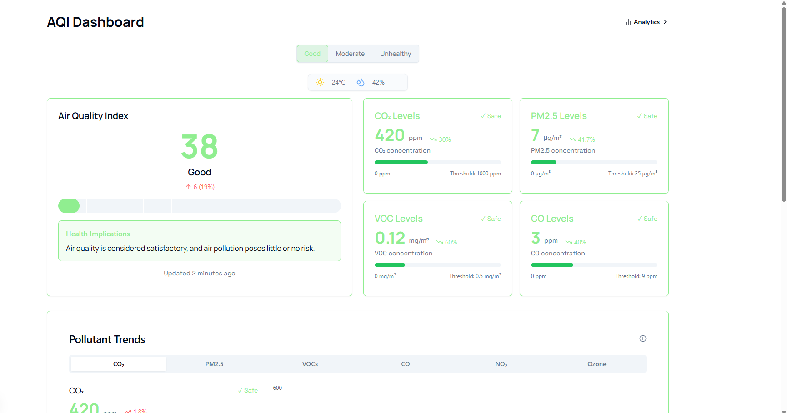
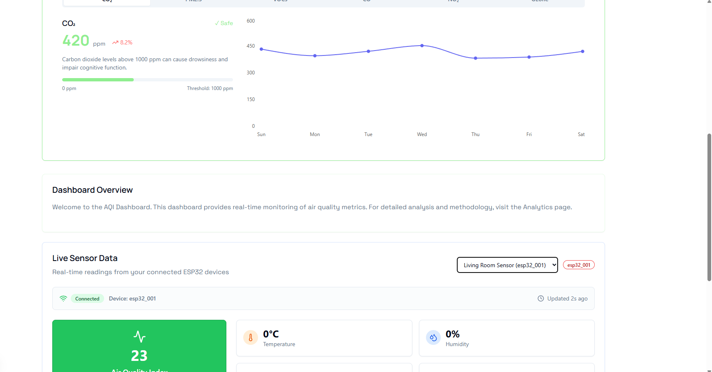
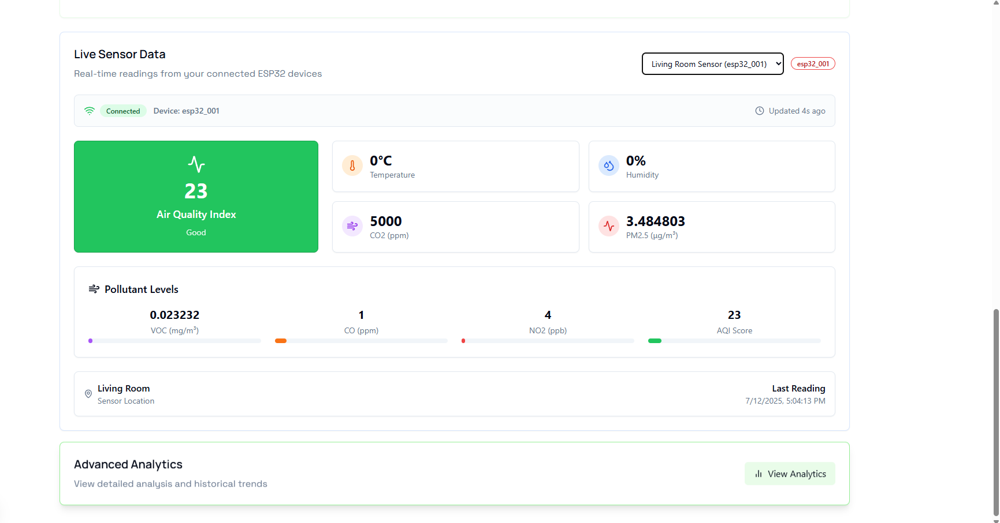
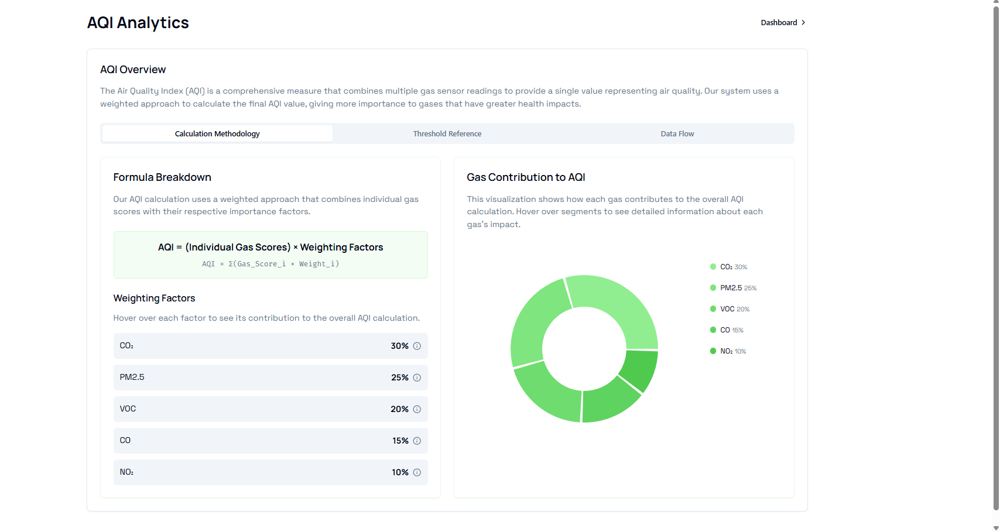
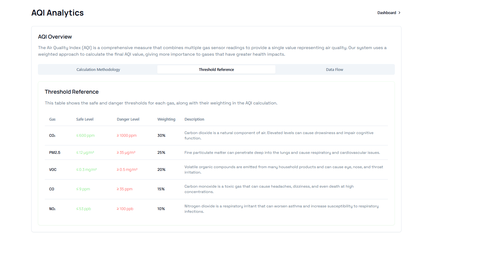
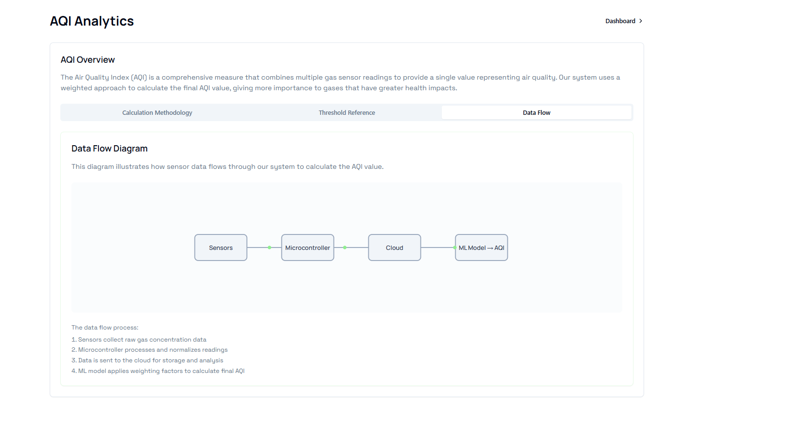
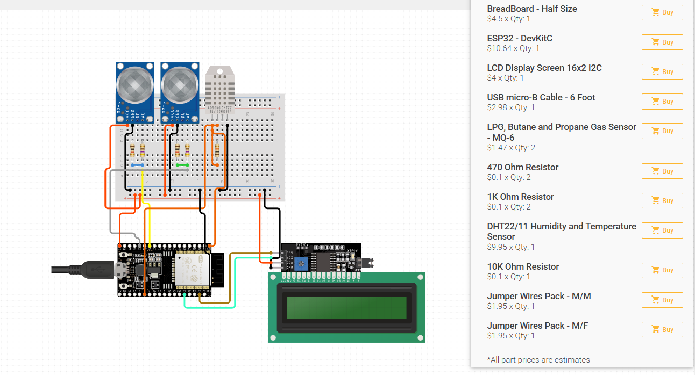
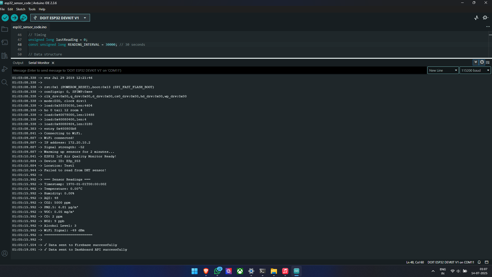

# 🌍 IoT Air Quality Monitoring Dashboard

A modern, real-time air quality monitoring dashboard built with Next.js 14, Firebase, and ESP32 sensors. Monitor AQI, temperature, humidity, CO2, PM2.5, and other pollutants with beautiful visualizations and real-time data streaming.

## 🚀 Live Demo

**[View Live Dashboard →](https://iotaqi353.netlify.app/)**

Experience the dashboard with live sensor data and interactive visualizations!

## 📸 Dashboard Screenshots

### Main Dashboard - Live Sensor Data


### Live Sensor Data Card


### Pollutant Trends Visualization


### Analytics Dashboard


### Threshold Reference Table


### Data Flow Diagram


### ESP32 Hardware Setup


### Arduino IDE Development


## ✨ Features

### 🏠 Homepage Dashboard
- **Live Sensor Data Card**: Real-time readings from your selected device
- **AQI Gauge**: Visual air quality indicator with color-coded status
- **Environmental Metrics**: Temperature, humidity, CO2, PM2.5 readings
- **Pollutant Levels**: VOC, CO, NO2 with progress bars and trend indicators
- **Device Selection**: Switch between multiple connected sensors
- **Responsive Design**: Works perfectly on desktop and mobile devices

### 📊 Analytics Page
- **AQI Calculation Methods**: Interactive formulas and explanations
- **Pollutant Thresholds**: WHO and EPA standards reference tables
- **Data Flow Diagrams**: Visual representation of sensor data processing
- **Gas Contribution Charts**: Breakdown of pollutant contributions to AQI
- **Trend Analysis**: Historical data patterns and insights

### 🔄 Real-time Features
- **Firebase Integration**: Live data streaming from sensors
- **Auto-refresh**: Real-time updates every few seconds
- **Connection Status**: Live connection monitoring
- **Device Status Tracking**: Online/offline status for each sensor

## 🚀 Quick Start

### 1. Installation

```bash
git clone <your-repo-url>
cd iot-dashboard
npm install
```

### 2. Firebase Setup

1. Create a Firebase project at [Firebase Console](https://console.firebase.google.com)
2. Enable Realtime Database
3. Copy your Firebase config
4. Create a `.env.local` file:

```env
NEXT_PUBLIC_FIREBASE_API_KEY=your_api_key
NEXT_PUBLIC_FIREBASE_AUTH_DOMAIN=your_project.firebaseapp.com
NEXT_PUBLIC_FIREBASE_DATABASE_URL=https://your_project-default-rtdb.firebaseio.com
NEXT_PUBLIC_FIREBASE_PROJECT_ID=your_project_id
NEXT_PUBLIC_FIREBASE_STORAGE_BUCKET=your_project.firebasestorage.app
NEXT_PUBLIC_FIREBASE_MESSAGING_SENDER_ID=your_sender_id
NEXT_PUBLIC_FIREBASE_APP_ID=your_app_id
```

### 3. Run the Application

```bash
npm run dev
```

Visit `http://localhost:3000` to see your dashboard with live sensor data!

## 📱 Pages & Features

### Homepage (`/`)
- **Live Sensor Data Card**: Real-time readings from selected device with automatic refresh
- **AQI Gauge**: Color-coded air quality visualization with status indicators
- **Environmental Metrics**: Temperature, humidity, CO2, PM2.5 with trend arrows
- **Pollutant Progress Bars**: VOC, CO, NO2 levels with threshold indicators
- **Device Selection**: Dropdown to switch between connected sensors
- **Responsive Layout**: Optimized for all screen sizes

### Analytics (`/analytics`)
- **AQI Calculation Formulas**: Interactive cards showing calculation methods
- **Pollutant Thresholds**: Reference tables for WHO and EPA standards
- **Data Flow Visualization**: How sensor data flows through the system
- **Gas Contribution Analysis**: Breakdown of each pollutant's impact on AQI
- **Educational Content**: Learn about air quality standards and measurements

## 🔧 API Endpoints

### Sensors API (`/api/sensors`)
- `GET` - Fetch latest sensor readings
- `POST` - Submit new sensor data from ESP32
- Query parameters: `deviceId`, `historical`, `limit`

### Devices API (`/api/devices`)
- `GET` - List all registered devices with status
- `POST` - Register new device
- `PUT` - Update device information

## 🛠️ ESP32 Integration

### Hardware Requirements
- ESP32 development board
- MQ-135 (Air Quality sensor)
- DHT22 (Temperature/Humidity)
- MQ-7 (CO sensor)
- Optional: PM2.5, VOC sensors

### Arduino Code
Upload the provided ESP32 code from `/arduino/esp32_sensor_code/esp32_sensor_code.ino`:

```cpp
// Configure your WiFi and Firebase details
const char* ssid = "your_wifi_name";
const char* password = "your_wifi_password";
const char* firebase_host = "your_project-default-rtdb.firebaseio.com";
```

### Data Format
The ESP32 sends data in this JSON format:
```json
{
  "deviceId": "esp32_001",
  "aqi": 75,
  "temperature": 24.5,
  "humidity": 45,
  "co2": 650,
  "pm25": 15.5,
  "voc": 0.3,
  "co": 5,
  "no2": 25,
  "location": "Living Room",
  "timestamp": "2025-01-07T12:00:00Z"
}
```

## 🏗️ Tech Stack

- **Frontend**: Next.js 14, React, TypeScript
- **Styling**: Tailwind CSS, Framer Motion
- **Database**: Firebase Realtime Database
- **Charts**: Recharts for data visualization
- **UI Components**: Custom UI components with shadcn/ui
- **Icons**: Lucide React
- **Hardware**: ESP32 with various sensors

## 🎨 Design Features

- **Modern UI**: Clean, professional design with smooth animations
- **Color-coded Status**: Intuitive color system for air quality levels
- **Responsive**: Works on desktop, tablet, and mobile
- **Real-time Updates**: Live data streaming with automatic refresh
- **Interactive Charts**: Hover effects and detailed tooltips

## 📊 Data Sources

### Supported Databases
- **Firebase Realtime Database** (Primary)
- **PostgreSQL** (Optional)
- **MongoDB** (Optional)

### Real-time Updates
- Firebase real-time listeners for live data
- Automatic reconnection handling
- Offline state management
- Data caching for performance

## 🔐 Security

- Environment variable configuration
- Firebase security rules
- API rate limiting
- Device authentication tokens

## 📈 Monitoring

- Device connection status
- Data quality indicators
- System health checks
- Error reporting and logging

## 🚀 Deployment

The application is optimized for modern deployment platforms:

1. **Build the Application**: Run `npm run build`
2. **Environment Variables**: Configure your Firebase environment variables
3. **Deploy**: Deploy to your preferred platform (Netlify, Vercel, etc.)
   - The app is available at `https://iotaqi353.netlify.app/`

### Environment Setup
Configure these environment variables:
- `NEXT_PUBLIC_FIREBASE_API_KEY`
- `NEXT_PUBLIC_FIREBASE_AUTH_DOMAIN`
- `NEXT_PUBLIC_FIREBASE_DATABASE_URL`
- `NEXT_PUBLIC_FIREBASE_PROJECT_ID`
- `NEXT_PUBLIC_FIREBASE_STORAGE_BUCKET`
- `NEXT_PUBLIC_FIREBASE_MESSAGING_SENDER_ID`
- `NEXT_PUBLIC_FIREBASE_APP_ID`

## 🔍 Demo Data

The system includes demo scenarios (Good/Moderate/Unhealthy) that generate realistic mock data for testing without physical sensors.

## 🤝 Contributing

1. Fork the repository
2. Create a feature branch
3. Make your changes
4. Submit a pull request

## 📄 License

This project is licensed under the MIT License.

## 🆘 Support

For issues or questions:
1. Check the Firebase setup guide in `firebase-setup.md`
2. Review the backend integration guide in `README_BACKEND.md`
3. Enable debug logging in your environment
4. Check ESP32 serial monitor for device connectivity

---

**Built with ❤️ using Next.js, Firebase, and ESP32**

**🌐 [View Live Demo](https://iotaqi353.netlify.app/)**
